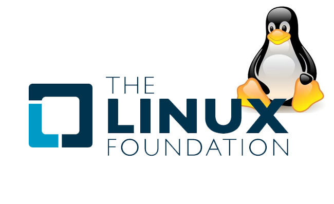
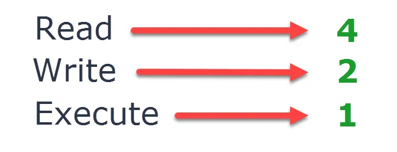
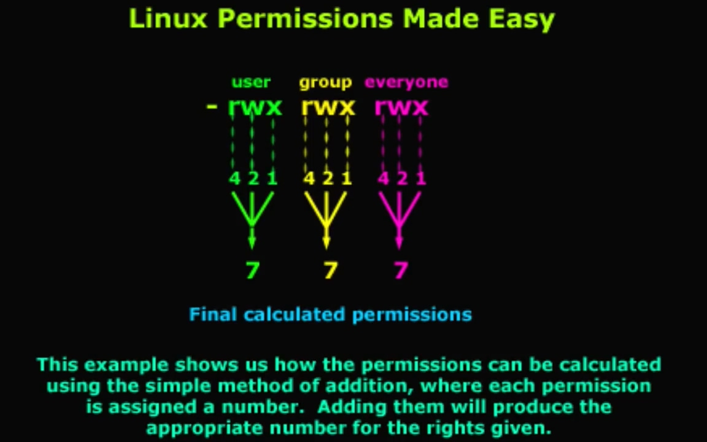

My works related to Linux operating system.

## Table of Contents
1. [Introduction.](#introduction)
2. [Official websites.](#websites)
3. [Developers.](#developers)
4. [Oracle VM VirtualBox display configuration.](#virtualbox)
5. [VMware Workstation 15 Player display configuration](#vmware)
6. [Linux terminal.](#terminal)
7. [Linux Standard Base.](#base)
8. [Bash script.](#bash)
9. [Emacs text editor.](#emacs)
10. [Linux permissions.](#permissions)
11. [Taking screenshot.](#screenshot)
12. [Searching file.](#locate)
13. [GitHub notes.](#github)
14. [GitHub repository calculation.](#calculation)

<a name="introduction"></a>
## 1. Introduction

Linux is the largest and most pervasive open source software project in history. It has seen massive acceptance in almost every sector, including financial services, government, education, and even film production. Linux is also the operating system of choice to support cutting-edge technologies such as the Internet of Things, cloud computing, and big data.

The Linux Foundation and its projects have more than 1,000 corporate members across the Americas, Asia-Pacific, and EMEA, including companies that are leaders in the strategic use of open source. A few include AT&T, Cisco, Fujitsu, Hitachi, Huawei, IBM, Intel, Microsoft, NEC, Oracle, Qualcomm, and Samsung.

Linux began in 1991 as a personal project of Linus Torvalds while studying computer science at University of Helsinki to create a new free operating system kernel. The resulting Linux kernel has been marked by constant growth throughout its history. Since the initial release of its source code in 1991, it has grown from a small number of C files under a license prohibiting commercial distribution to the 4.15 version in 2018 with more than 23.3 million lines of source code, not counting comments, under the GNU General Public License v2.

A Linux distribution (often abbreviated as distro) is an operating system made from a software collection, which is based upon the Linux kernel and, often, a package management system. Linux users usually obtain their operating system by downloading one of the Linux distributions, which are available for a wide variety of systems ranging from embedded devices and personal computers  to powerful supercomputers.

<a name="github"></a>
## 2. Official websites
The Linux Foundation official website : https://www.linuxfoundation.org <br />

**_Linux Distros_** <br />
Ubuntu official website : https://ubuntu.com <br />
Debian official website : https://www.debian.org <br />
Kali official website : https://www.kali.org <br />
Parrot official website : https://parrotlinux.org/ <br />

**_virtual machines_** <br />
Oracle VM VirtualBox official website : https://www.virtualbox.org <br />
VMWare official website : https://www.vmware.com <br />

**_Linux related articles_** <br />
touch command in Linux with Examples by GeeksforGeeks : https://www.geeksforgeeks.org/touch-command-in-linux-with-examples/ <br />
How to Use the rename Command on Linux by Dave McKay : https://www.howtogeek.com/423214/how-to-use-the-rename-command-on-linux/ <br />
id command in Linux by Linuxize : https://linuxize.com/post/id-command-in-linux/ <br />

<a name="developers"></a>
## 3. Developers
Linux operating system was created by Linux Torvalds : https://github.com/torvalds <br />
Dave McKay : https://twitter.com/TheGurkha <br />

<a name="virtualbox"></a>
## 4. Oracle VM VirtualBox display configuration
Oracle VM VirtualBox (formerly Sun VirtualBox, Sun xVM VirtualBox and Innotek VirtualBox) is a free and open-source hosted hypervisor for x86 virtualization, developed by Oracle Corporation. Created by Innotek GmbH, it was acquired by Sun Microsystems in 2008, which was, in turn, acquired by Oracle in 2010.

VirtualBox is free and open source virtualization software from Oracle. It enables you to install other operating systems like Linux operating system in virtual machines. It is recommended that your system should have at least 4GB of RAM to get decent performance from the virtual operating system.

By default the graphic controller setting in Oracle VM VirtualBox is set to VMSVGA, this caused the system to operate very slow especially if you are using Microsoft Windows 10. To fix this press **[Ctrl]** + **[S]** on your keyboard, then click on the Display on the right of the VirtualBox user interface, and then under the Graphics Controller drop down list, select **[VBoxVGA]** and start the Linux virtual machine to check back the performance of the machine. Tick the box beside Acceleration to Enable 3D Acceleration. Pause the antivirus when using the VirtualBox.

<a name="vmware"></a>
## 5. VMware Workstation 15 Player display configuration
VMware Workstation is a hosted hypervisor that runs on x64 versions of Windows and Linux operating systems, it enables users to set up virtual machines (VMs) on a single physical machine, and use them simultaneously along with the actual machine. Each virtual machine can execute its own operating system, including versions of Microsoft Windows, Linux, BSD, and MS-DOS. VMware Workstation is developed and sold by VMware, Inc., a division of Dell Technologies. VMware Workstation supports bridging existing host network adapters and sharing physical disk drives and USB devices with a virtual machine. It can simulate disk drives; an ISO image file can be mounted as a virtual optical disc drive, and virtual hard disk drives are implemented as .vmdk files.

To switch between VMware virtual machine and the local machine, press **[Ctrl]** + **[Alt]**.

To view the VMware virtual machine in full mode, do this commands.
```
$ sudo apt-get install open-vm-tools
$ sudo apt-get install open-vm-tools-desktop
```
Restart the VMware virtual machine to view the desired effect.

<a name="terminal"></a>
## 6. Linux terminal
Terminal is just a mechanism to transfer information. For the operating system to understand the information, a shell is needed. A shell in Linux is a program that interprets the commands you enter in a terminal window, so the operating system can understand what you want to do. To open the terminal simply press **[Ctrl]** + **[Alt]** + **[T]** on your keyboard.

There are many shell programs, such as Bash, Zsh, Csh, Ksh etc. Bash is the default shell on most Linux distributions. When you open a terminal window, a Bash shell is automatically started. To check which shell you are using now, run the following command.
```
$ echo $0
```

To make the text in terminal bigger, press **[Ctrl]** + **[Shift]** + **[+]** on your keyboard. To make the text in the terminal smaller, press **[Ctrl]** + **[-]** on your keyboard. To make the terminal transparent, right hand click on your mouse, click `Preferences`, on the menu shown, click `Colors` beside the `Text` on top of the menu shown, tick `Use transparent background`, and then move the scrollbar beside it to choose your desired transparency for your terminal.

<a name="base"></a>
## 7. Linux Standard Base
The lsb_release command prints certain LSB (Linux Standard Base) and Distribution information.
```
$ lsb_release -a
$ cat /etc/*release*
```

<a name="bash"></a>
## 8. Bash script
In the realm of Linux (and computers in general) we have the concept of programs and processes. A program is a blob of binary data consisting of a series of instructions for the CPU and possibly other resources (images, sound files and such) organised into a package and typically stored on your hard disk. When we say we are running a program we are not really running the program but a copy of it which is called a process. What we do is copy those instructions and resources from the hard disk into working memory (or RAM). We also allocate a bit of space in RAM for the process to store variables (to hold temporary working data) and a few flags to allow the operating system (OS) to manage and track the process during it's execution.

Essentially a process is a running instance of a program. When we are at the terminal we have a Bash process running in order to give us the Bash shell. If we start a script running it doesn't actually run in that process but instead starts a new process to run inside.A Bash script is a plain text file which contains a series of commands.

<a name="emacs"></a>
## 9. Emacs text editor
Emacs is primarily a text editor and is designed for manipulating pieces of text, although it is capable of formatting and printing documents like a word processor by interfacing with external programs such as LaTeX, Ghostscript or a web browser. Emacs provides commands to manipulate and differentially display semantic units of text such as words, sentences, paragraphs and source code constructs such as functions. It also features keyboard macros for performing user-defined batches of editing commands.

GNU Emacs is a real-time display editor, as its edits are displayed onscreen as they occur. This is standard behavior for modern text editors but EMACS was among the earliest to implement this functionality instead of having to issue a separate command to insert new edits into the existing text as in vi.

To install the latest stable version of Emacs for Linux Ubuntu, do this commands.
```
$ sudo apt-get update
$ sudo apt-get install emacs
$ emacs --version
```

To check whether emacs already installed in the Linux machine, do this command.
```
apt policy emacs
```

**_keyboard meanings_** <br />
\<Return> = [Enter] <br />
M-x = meta + x = [Esc] + [X]

Emacs was created by by Richard Stallman and his team in MIT Computer Science and Artificial Intelligence Laboratory : https://github.com/richardmstallman

<a name="permissions"></a>
## 10. Linux permissions

 

Every file and directory in Linux system has following 3 permissions.

**Read** : This permission give you the authority to open and read a file. Read permission on a directory gives you the ability to lists its content.

**Write** : The write permission gives you the authority to modify the contents of a file. The write permission on a directory gives you the authority to add, remove and rename files stored in the directory. Consider a scenario where you have to write permission on file but do not have write permission on the directory where the file is stored. You will be able to modify the file contents. But you will not be able to rename, move or remove the file from the directory.

**Execute** : In Windows, an executable program usually has an extension ".exe" and which you can easily run. In Unix/Linux, you cannot run a program unless the execute permission is set. If the execute permission is not set, you might still be able to see/modify the program code(provided read & write permissions are set), but not run it.

 

**_Permission Set_** <br />
– Each permission group has three permissions, called a permission set. <br />
– Each set consists of read, write, and execute permissions. <br />
– Each file or directory has three permission sets for the three types of permission groups. <br />
– The first permission set represents the owner permissions, the second set represents the group permissions, and the last set represents the other permissions. <br />
– The `read`, `write`, and `execute` permissions are represented by the characters r, w, and x, respectively. <br />
– The presence of any of these characters, such as r, indicates that the particular permission is granted. <br />
– A dash (–) symbol in place of a character in a permission set indicates that a particular permission is denied. <br />
– Linux assigns initial permissions automatically when a new file or directory is created.
 
 

<a name="screenshot"></a>
## 11. Taking screenshot
Press **[PrtSc]** on your keyboard to take full entire screenshot of the Linux system, press **[Shift]** + **[PrtSc]** and drag the mouse to take the partial screenshot of the Linux system, press **[Alt]** + **[PrtSc]** to take the particular window screenshot.

All the screenshots are stored inside `/root/Pictures/` folder.

<a name="locate"></a>
## 12. Searching file
To find, searching for file in Linux machine, first we need to update the database and then use the locate command. It will take some time to update the database, wait until it finish and then proceed to locate command.
```
$ updatedb
$ locate filename.txt
```

<a name="github"></a>
## 13. GitHub notes
Initialize repository, adding GitHub remote repository and check the remote repository
```
$ git init
$ git remote add origin https://github.com/syakirharis25/Linux.git
$ git remote -v
$ git status
```
If there is a message <br />
Please move or remove them before you merge. <br />
Aborting

Then do this commands.
```
$ git clean -d -f
$ git pull origin master
$ git status
```

Clone the current GitHub remote repository contents into local machine.
```
$ git clone https://github.com/syakirharis25/Linux.git
$ cd Linux/
$ git remote -v
$ git status
```

<a name="calculation"></a>
## 14. GitHub repository calculation.
```
-------------------------------------------------------------------------------
Language                     files          blank        comment           code
-------------------------------------------------------------------------------
Markdown                         1             41              0            132
-------------------------------------------------------------------------------
```
Refer to : https://github.com/syakirharis25/cloc
